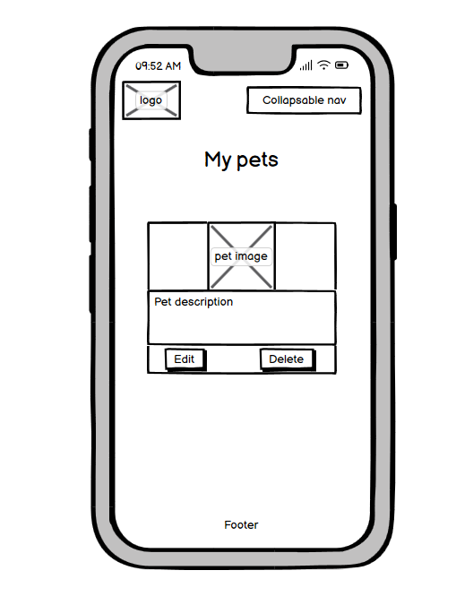
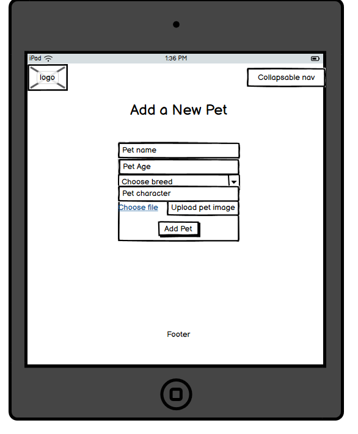
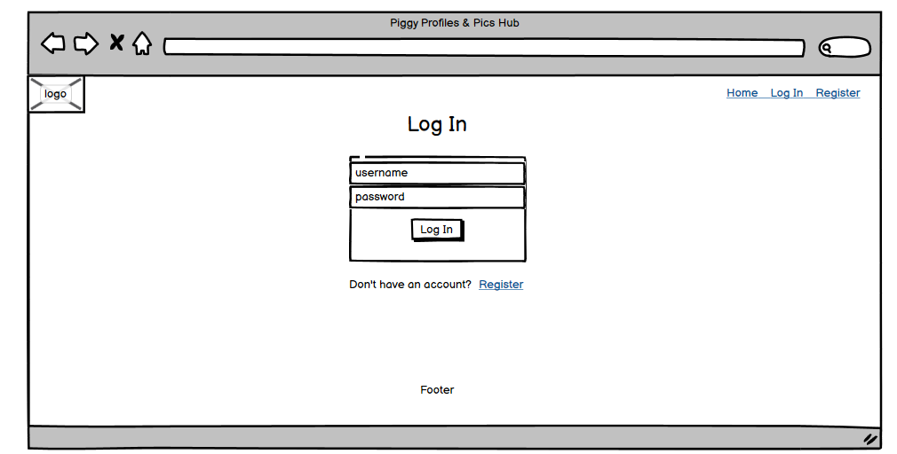
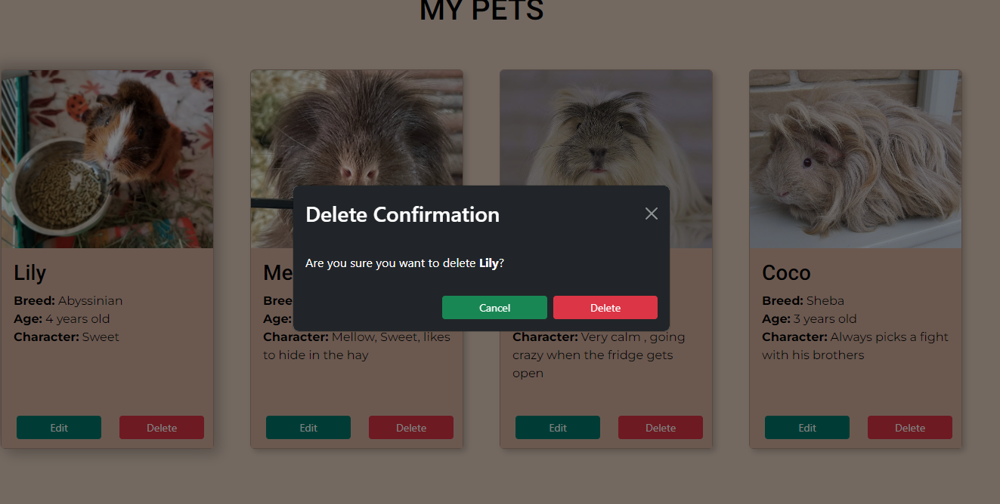
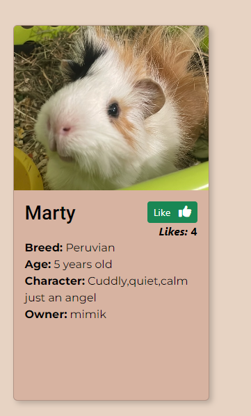

# [GUINEA PIG DATABASE](https://flask-guinea-pig-database-ccd8a0a6a383.herokuapp.com)

[](https://github.com/marina9222/guinea-pig-database/commits/main)
[](https://github.com/marina9222/guinea-pig-database/commits/main)
[](https://github.com/marina9222/guinea-pig-database)


# Description 

Piggy Profiles & Pics Hub is a website for guinea pig owners or just a guinea pig lover to register and add their own pet.
Once added people can like the pet and if it gets the most likes it will come first in the row on the home page.
Even if the user don't have a guinea pig can still register and check out the other guinea pigs and read about different breeds.
It's basically a database where users can show their guinea pig with a photo and description.


source: [amiresponsive](https://ui.dev/amiresponsive?url=https://flask-guinea-pig-database-ccd8a0a6a383.herokuapp.com)

## UX

The homepage effectively displays profiles with images and key details (breed, age, character) in a grid layout. This helps users quickly look and identify guinea pigs that they like.
The layout adjusts well to different screen sizes, ensuring usability on both desktops and mobile devices.The primary navigation menu includes essential links (Home, Log In, Register) making it easy for users to find and access these features.Each guinea pig profile provides relevant information such as breed, age, character traits, and owner’s name.
The design is straightforward, allowing users to browse profiles without unnecessary steps.

### Colour Scheme

- `#c6b6a7` used for primary color.
- `#e7d3c3` used for secondary color.
- `#d7b3a1` used for tertiery color.
- `#342719` used for primary text color.
- `#00796b` used for button color.

I used [coolors.co](https://coolors.co/c6b6a7-e7d3c3-d7b3a1-342719-00796b) to generate my colour palette.


I've used CSS `:root` variables to easily update the global colour scheme by changing only one value, instead of everywhere in the CSS file.

```css
:root {
    
    --main-color: #c6b6a7;
    --secondary-color: #e7d3c3;
    --tertiery-color: #d7b3a1;
    --text-color-primary: #342719;
    --secondary-text-color: #000000;
    --button-color: #00796b;
    --button-hover: #0d6357;
}
```

### Typography

- [Roboto](https://fonts.google.com/specimen/Roboto) was used for the primary headers and titles.

- [Montserrat](https://fonts.google.com/specimen/Montserrat) was used for all the other secondary text.

- [Font Awesome](https://fontawesome.com) icons were used throughout the site, such as the ones in the Register/Login form and Add and Edit pet form.


## User Stories

### New Site Users

- As a new site user, I would like to easily create an account, so that I can log in and browse the guinea pigs profiles.
- As a new site user, I would like to be able to browse the guinea pig profiles, even without a registration.
- As a new site user, I would like to add my pet, so that people can see it and like it.
- As a new site user, I would like to have a like/unlike buttons, so that I can choose which guinea pigs I like and which guinea pigs I don't.
- As a new site user, I would like to be able to edit my pet, if I make a mistake when adding it the first time or I would like to change its picture.
- As a new site user, I would like to be able to delete my pet, if I decide to.
- As a new site user, I would like to have a page with all the guinea pig breeds with some information about each breed and see only the pets from each breed I choose to check.

### Returning Site Users

- As a returning site user, I would like to have a liked pets section, so that I can see only the pets I liked already.
- As a returning site user, I would like to have a search bar available on the home page, so that I can search a guinea pig by name/age/breed etc.
- As a returning site user, I would like to receive notifications if I enable them, so that I can know every time a person adds a new pet.
- As a returning site user, I would like to have the option to add multiple pictures of my guinea pig when adding one instead of only one.
- As a returning site user, I would like to have a carousel with all the pets, so that I can navigate with arrows and don't have to go all the way down the page to see all of them.

## Wireframes

To follow best practice, wireframes were developed for mobile, tablet, and desktop sizes.
I've used [Balsamiq](https://balsamiq.com/wireframes) to design my site wireframes.

### Mobile Wireframes

<details>
<summary> Click here to see the Mobile Wireframes </summary>

Home
  - 

Home/Logged In
  - 

Add Pet
  - 

Edit Pet
  - 

Breeds
  - 

Breed Details
  - 

My Pets
  - 

Register
  - 

Log In
  - 


</details>

### Tablet Wireframes

<details>
<summary> Click here to see the Tablet Wireframes </summary>

Home
  - 

Home/Logged In
  - 

Add Pet
  - 

Edit Pet
  - 

Breeds
  - 

Breed Details
  - 

My Pets
  - 

Register
  - 

Log In
  - 


</details>


### Desktop Wireframes

<details>
<summary> Click here to see the Desktop Wireframes </summary>

Home
  - 

Home/Logged In
  - 

Add Pet
  - 

Edit Pet
  - 

Breeds
  - 

Breed Details
  - 

My Pets
  - 

Register
  - 

Log In
  - 


</details>


## Features


### Existing Features


- **Register form**

    - Register form for a new user to register and be able to log in and use all the features of the website.


- **Log In form**

    - Log In form for already registered users.


- **Add Pet**

    - Add Pet feature allows a registered user to add their own pet to the database.


- **Find guinea pigs by breed**

    - Help users to quickly find guinea pigs sorted by their breed.


- **Breed information**

    - Showing the user only guinea pigs by the chosen breed and give them some information about the breed.


- **My Pets**

    - Shows only the user's pets so the pet could be edited or deleted if desired.


- **Edit Pet**

    - Allows registered user to edit their pet if desired.


- **Delete Pet**

    - Allows registered user to delete their pet if desired.




- **Unlike Pet**

    - Allows registered user to unlike a pet if liked by mistake.


- **Like Pet**

    - Allows registered user to like a pet from the database.




### Future Features

- Liked pets section
    - A section showing the registered user only the pets they liked.

- Search bar
    - Search bar on the home page allowing the user to search for a pet by name/age/breed/likes.

- Notifications
    - Allow registered user to receive notifications about new added pets by email or pop up.

- Multiple images when adding a new pet
    - User the be allowed to upload more than one picture of their pet when adding one.

- Images carousel
    - Carousel showing the images on the home page so it could be easier to go through all of them , instead of scrolling all the way down.


## Tools & Technologies Used

- [](https://tim.2bn.dev/markdown-builder) used to generate README and TESTING templates.
- [](https://git-scm.com) used for version control. (`git add`, `git commit`, `git push`)
- [](https://github.com) used for secure online code storage.
- [](https://gitpod.io) used as a cloud-based IDE for development.
- [](https://en.wikipedia.org/wiki/HTML) used for the main site content.
- [](https://en.wikipedia.org/wiki/CSS) used for the main site design and layout.
- [](https://www.python.org) used as the back-end programming language.
- [](https://www.heroku.com) used for hosting the deployed back-end site.
- [](https://getbootstrap.com) used as the front-end CSS framework for modern responsiveness and pre-built components.
- [](https://flask.palletsprojects.com) used as the Python framework for the site.
- [](https://www.mongodb.com) used as the non-relational database management with Flask.
- [](https://cloudinary.com) used for online static file storage.
- [](https://balsamiq.com/wireframes) used for creating wireframes.
- [](https://fontawesome.com) used for the icons.
- [](https://chat.openai.com) used to help debug, troubleshoot, and explain things.

## Database Design

My project uses a non-relational database with MongoDB, and therefore the database architecture
doesn't have actual relationships like a relational database would.

My database is called **guineaPigsDB**.

It contains 3 collections:

- **breeds**
    | Key | Type | Notes |
    | --- | --- | --- |
    | _id | ObjectId() | |
    | pet_breed | String | |
    | info | String | |
    | breed_image | String | |

- **pets**
    | Key | Type | Notes |
    | --- | --- | --- |
    | _id | ObjectId() | |
    | pet_name | String | |
    | pet_age | String | |
    | pet_breed | String | selected from *breeds* collection |
    | pet_character | String | |
    | image_url | String | |
    | owner | String | selected from the *users* collection |

- **users**
    | Key | Type | Notes |
    | --- | --- | --- |
    | _id | ObjectId() | |
    | username | String | |
    | password | String | uses Secure Hash Algorithm (SHA) |
