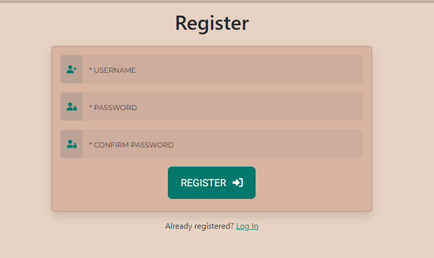
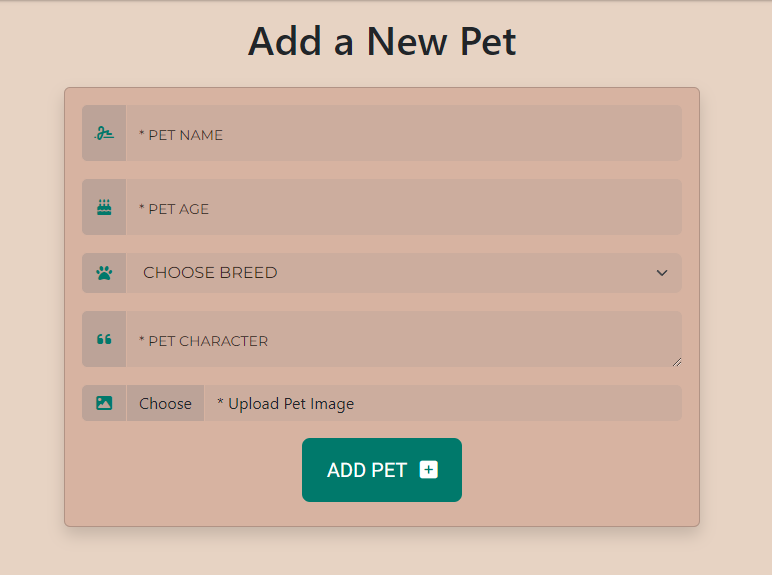
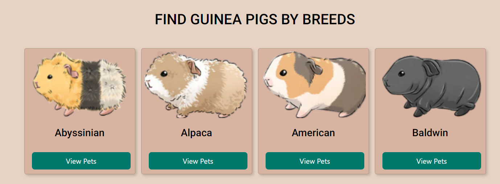
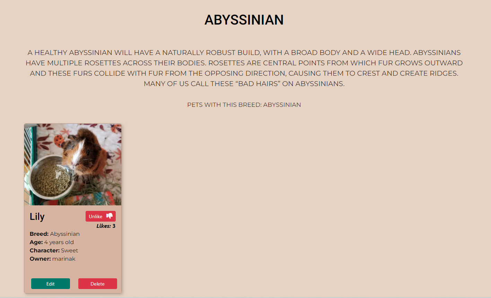
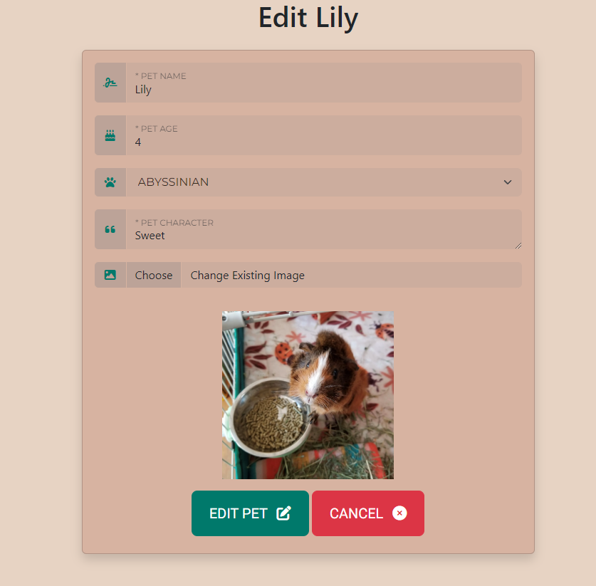

# [GUINEA PIG DATABASE](https://flask-guinea-pig-database-ccd8a0a6a383.herokuapp.com)

[](https://github.com/marina9222/guinea-pig-database/commits/main)
[](https://github.com/marina9222/guinea-pig-database/commits/main)
[](https://github.com/marina9222/guinea-pig-database)


# Description 

Piggy Profiles & Pics Hub is a website for guinea pig owners or just a guinea pig lover to register and add their own pet.
Once added people can like the pet and if it gets the most likes it will come first in the row on the home page.
Even if the user don't have a guinea pig can still register and check out the other guinea pigs and read about different breeds.
It's basically a database where users can show their guinea pig with a photo and description.


source: [amiresponsive](https://ui.dev/amiresponsive?url=https://flask-guinea-pig-database-ccd8a0a6a383.herokuapp.com)

## UX

The homepage effectively displays profiles with images and key details (breed, age, character) in a grid layout. This helps users quickly look and identify guinea pigs that they like.
The layout adjusts well to different screen sizes, ensuring usability on both desktops and mobile devices.The primary navigation menu includes essential links (Home, Log In, Register) making it easy for users to find and access these features.Each guinea pig profile provides relevant information such as breed, age, character traits, and owner’s name.
The design is straightforward, allowing users to browse profiles without unnecessary steps.

### Colour Scheme

- `#c6b6a7` used for primary color.
- `#e7d3c3` used for secondary color.
- `#d7b3a1` used for tertiery color.
- `#342719` used for primary text color.
- `#00796b` used for button color.

I used [coolors.co](https://coolors.co/c6b6a7-e7d3c3-d7b3a1-342719-00796b) to generate my colour palette.


I've used CSS `:root` variables to easily update the global colour scheme by changing only one value, instead of everywhere in the CSS file.

```css
:root {
    
    --main-color: #c6b6a7;
    --secondary-color: #e7d3c3;
    --tertiery-color: #d7b3a1;
    --text-color-primary: #342719;
    --secondary-text-color: #000000;
    --button-color: #00796b;
    --button-hover: #0d6357;
}
```

### Typography

- [Roboto](https://fonts.google.com/specimen/Roboto) was used for the primary headers and titles.

- [Montserrat](https://fonts.google.com/specimen/Montserrat) was used for all the other secondary text.

- [Font Awesome](https://fontawesome.com) icons were used throughout the site, such as the ones in the Register/Login form and Add and Edit pet form.


## User Stories

### New Site Users

- As a new site user, I would like to easily create an account, so that I can log in and browse the guinea pigs profiles.
- As a new site user, I would like to be able to browse the guinea pig profiles, even without a registration.
- As a new site user, I would like to add my pet, so that people can see it and like it.
- As a new site user, I would like to have a like/unlike buttons, so that I can choose which guinea pigs I like and which guinea pigs I don't.
- As a new site user, I would like to be able to edit my pet, if I make a mistake when adding it the first time or I would like to change its picture.
- As a new site user, I would like to be able to delete my pet, if I decide to.
- As a new site user, I would like to have a page with all the guinea pig breeds with some information about each breed and see only the pets from each breed I choose to check.

### Returning Site Users

- As a returning site user, I would like to have a liked pets section, so that I can see only the pets I liked already.
- As a returning site user, I would like to have a search bar available on the home page, so that I can search a guinea pig by name/age/breed etc.
- As a returning site user, I would like to receive notifications if I enable them, so that I can know every time a person adds a new pet.
- As a returning site user, I would like to have the option to add multiple pictures of my guinea pig when adding one instead of only one.
- As a returning site user, I would like to have a carousel with all the pets, so that I can navigate with arrows and don't have to go all the way down the page to see all of them.

## Wireframes

To follow best practice, wireframes were developed for mobile, tablet, and desktop sizes.
I've used [Balsamiq](https://balsamiq.com/wireframes) to design my site wireframes.

### Mobile Wireframes

<details>
<summary> Click here to see the Mobile Wireframes </summary>

Home
  - 

Home/Logged In
  - 

Add Pet
  - 

Edit Pet
  - 

Breeds
  - 

Breed Details
  - 

My Pets
  - 

Register
  - 

Log In
  - 


</details>

### Tablet Wireframes

<details>
<summary> Click here to see the Tablet Wireframes </summary>

Home
  - 

Home/Logged In
  - 

Add Pet
  - 

Edit Pet
  - 

Breeds
  - 

Breed Details
  - 

My Pets
  - 

Register
  - 

Log In
  - 


</details>


### Desktop Wireframes

<details>
<summary> Click here to see the Desktop Wireframes </summary>

Home
  - 

Home/Logged In
  - 

Add Pet
  - 

Edit Pet
  - 

Breeds
  - 

Breed Details
  - 

My Pets
  - 

Register
  - 

Log In
  - 


</details>


## Features


### Existing Features


- **Register form**

    - Register form for a new user to register and be able to log in and use all the features of the website.




- **Log In form**

    - Log In form for already registered users.


- **Add Pet**

    - Add Pet feature allows a registered user to add their own pet to the database.




- **Find guinea pigs by breed**

    - Help users to quickly find guinea pigs sorted by their breed.




- **Breed information**

    - Showing the user only guinea pigs by the chosen breed and give them some information about the breed.




- **My Pets**

    - Shows only the user's pets so the pet could be edited or deleted if desired.


- **Edit Pet**

    - Allows registered user to edit their pet if desired.




- **Delete Pet**

    - Allows registered user to delete their pet if desired.


- **Unlike Pet**

    - Allows registered user to unlike a pet if liked by mistake.


- **Like Pet**

    - Allows registered user to like a pet from the database.


### Future Features

- Liked pets section
    - A section showing the registered user only the pets they liked.

- Search bar
    - Search bar on the home page allowing the user to search for a pet by name/age/breed/likes.

- Notifications
    - Allow registered user to receive notifications about new added pets by email or pop up.

- Multiple images when adding a new pet
    - User the be allowed to upload more than one picture of their pet when adding one.

- Images carousel
    - Carousel showing the images on the home page so it could be easier to go through all of them , instead of scrolling all the way down.


## Tools & Technologies Used

- [](https://tim.2bn.dev/markdown-builder) used to generate README and TESTING templates.
- [](https://git-scm.com) used for version control. (`git add`, `git commit`, `git push`)
- [](https://github.com) used for secure online code storage.
- [](https://gitpod.io) used as a cloud-based IDE for development.
- [](https://en.wikipedia.org/wiki/HTML) used for the main site content.
- [](https://en.wikipedia.org/wiki/CSS) used for the main site design and layout.
- [](https://www.python.org) used as the back-end programming language.
- [](https://www.heroku.com) used for hosting the deployed back-end site.
- [](https://getbootstrap.com) used as the front-end CSS framework for modern responsiveness and pre-built components.
- [](https://flask.palletsprojects.com) used as the Python framework for the site.
- [](https://www.mongodb.com) used as the non-relational database management with Flask.
- [](https://cloudinary.com) used for online static file storage.
- [](https://balsamiq.com/wireframes) used for creating wireframes.
- [](https://fontawesome.com) used for the icons.
- [](https://chat.openai.com) used to help debug, troubleshoot, and explain things.
- [](https://www.canva.com) used for designing the logo.


## Database Design

My project uses a non-relational database with MongoDB, and therefore the database architecture
doesn't have actual relationships like a relational database would.

My database is called **guineaPigsDB**.

It contains 3 collections:

- **breeds**
    | Key | Type | Notes |
    | --- | --- | --- |
    | _id | ObjectId() | |
    | pet_breed | String | |
    | info | String | |
    | breed_image | String | |

- **pets**
    | Key | Type | Notes |
    | --- | --- | --- |
    | _id | ObjectId() | |
    | pet_name | String | |
    | pet_age | String | |
    | pet_breed | String | selected from *breeds* collection |
    | pet_character | String | |
    | image_url | String | |
    | owner | String | selected from the *users* collection |

- **users**
    | Key | Type | Notes |
    | --- | --- | --- |
    | _id | ObjectId() | |
    | username | String | |
    | password | String | uses Secure Hash Algorithm (SHA) |


https://mermaid.live/edit#pako:eNqVUstugzAQ_BW0Z4KA8PS5l556yK2KhDZ4k9AGGxmjNCX8e21Ik7bkkPpieWc8O-N1D6XkBAxIPVW4U1ivhWPWRhHx1umnk10vmzcq9TN3iorfqiutKrFzGtLFeGWGVGIrZ8WRWlQ17mjChmkzMv_rKbCmu8BV-SGTFin3qLDUpOYRrM-iU4cZIo_im39J0LWkHo9g2fcjYNsepeJX7V9TOZ8XC9lPr8WcNdyCwU8Xf2mTWwAXalI1VtyMfXS6Br0n4wIsi6N6tzqD4WGn5eokSmBadeRC13DUdPkowLZ4aE21QQGshw9gceCleZAlWZokQZgt89iFE7A09qIgDXM_SrM8TJNscOFTSqPge3mQJ36Y-LG_DKIwjEe51xG0PYcvToTLWQ

## Testing

> [!NOTE]  
> For all testing, please refer to the [TESTING.md](TESTING.md) file.


## Deployment

The live deployed application can be found deployed on [Heroku](https://flask-guinea-pig-database-ccd8a0a6a383.herokuapp.com).

### MongoDB Non-Relational Database

This project uses [MongoDB](https://www.mongodb.com) for the Non-Relational Database.

To obtain your own MongoDB Database URI, sign-up on their site, then follow these steps:

- The name of the database on MongoDB should be called **insert-your-database-name-here**.
- The collection(s) needed for this database should be **insert-your-collection-names-here**.
- Click on the **Cluster** name created for the project.
- Click on the **Connect** button.
- Click **Connect Your Application**.
- Copy the connection string, and replace `password` with your own password (also remove the angle-brackets).

### Heroku Deployment

This project uses [Heroku](https://www.heroku.com), a platform as a service (PaaS) that enables developers to build, run, and operate applications entirely in the cloud.

Deployment steps are as follows, after account setup:

- Select **New** in the top-right corner of your Heroku Dashboard, and select **Create new app** from the dropdown menu.
- Your app name must be unique, and then choose a region closest to you (EU or USA), and finally, select **Create App**.
- From the new app **Settings**, click **Reveal Config Vars**, and set your environment variables.

> [!IMPORTANT]  
> This is a sample only; you would replace the values with your own if cloning/forking my repository.

| Key | Value |
| --- | --- |
| `DATABASE_URL` | user's own value |
| `IP` | 0.0.0.0 |
| `MONGO_DBNAME` | user's own value |
| `MONGO_URI` | user's own value |
| `PORT` | 5000 |
| `SECRET_KEY` | user's own value |

Heroku needs three additional files in order to deploy properly.

- requirements.txt
- Procfile
- runtime.txt

You can install this project's **requirements** (where applicable) using:

- `pip3 install -r requirements.txt`

If you have your own packages that have been installed, then the requirements file needs updated using:

- `pip3 freeze --local > requirements.txt`

The **Procfile** can be created with the following command:

- `echo web: python app.py > Procfile`
- *replace **app.py** with the name of your primary Flask app name; the one at the root-level*

The **runtime.txt** file needs to know which Python version you're using:
1. type: `python3 --version` in the terminal.
2. in the **runtime.txt** file, add your Python version:
	- `python-3.9.19`

For Heroku deployment, follow these steps to connect your own GitHub repository to the newly created app:

Either:

- Select **Automatic Deployment** from the Heroku app.

Or:

- In the Terminal/CLI, connect to Heroku using this command: `heroku login -i`
- Set the remote for Heroku: `heroku git:remote -a app_name` (replace *app_name* with your app name)
- After performing the standard Git `add`, `commit`, and `push` to GitHub, you can now type:
	- `git push heroku main`

The project should now be connected and deployed to Heroku!

### Local Deployment

This project can be cloned or forked in order to make a local copy on your own system.

For either method, you will need to install any applicable packages found within the *requirements.txt* file.

- `pip3 install -r requirements.txt`.

If you are using SQLAlchemy for your project, you need to create a local PostgreSQL database.
In this example, the example database name is **db-name**.

```shell
workspace (branch) $ set_pg
workspace (branch) $ psql

... connection to postgres ...

postgres=# CREATE DATABASE db-name;
CREATE DATABASE
postgres=# \c db-name;
You are now connected to database "db-name" as user "foobar".
db-name=# \q
```

Once that database is created, you must migrate the database changes from your models.py file.
This example uses **app-name** for the name of the primary Flask application.

```shell
workspace (branch) $ python3

... connection to Python CLI ...

>>> from app-name import db
>>> db.create_all()
>>> exit()
```

To confirm that the database table(s) have been created, you can use the following:

```shell
workspace (branch) $ psql -d db-name

... connection to postgres ...

postgres=# \dt

	List of relations
Schema | Name | Type | Owner
-------+------+------+--------
public | blah1 | table | foobar
public | blah2 | table | foobar
public | blah3 | table | foobar

db-name=# \q
```

You will need to create a new file called `env.py` at the root-level,
and include the same environment variables listed above from the Heroku deployment steps, plus a few extras.

> [!IMPORTANT]  
> This is a sample only; you would replace the values with your own if cloning/forking my repository.

Sample `env.py` file:

```python
import os

os.environ.setdefault("IP", "0.0.0.0")
os.environ.setdefault("MONGO_DBNAME", "user's own value")
os.environ.setdefault("MONGO_URI", "user's own value")
os.environ.setdefault("PORT", "5000")
os.environ.setdefault("SECRET_KEY", "user's own value")


os.environ.setdefault("DB_URL", "user's own value")
os.environ.setdefault("DEBUG", "True")
os.environ.setdefault("DEVELOPMENT", "True")
```

If using Flask-Migrate, make sure to include the following steps as well.

During the course of development, it became necessary to update the PostgreSQL data models.
In order to do this, [Flask-Migrate](https://flask-migrate.readthedocs.io) was used.

- `pip3 install Flask-Migrate`
- Import the newly installed package on your main `__init__.py` file:
	- `from flask_migrate import Migrate`
- Define **Migrate** in the same file after **app** and **db** are defined:
	- `migrate = Migrate(app, db)`
- Initiate the migration changes in the terminal:

```shell
workspace (branch) $ flask db init

	... generating migrations ...

workspace (branch) $ set_pg
workspace (branch) $ flask db migrate -m "Add a commit message for this migration"

	... migrating changes ...

workspace (branch) $ flask db upgrade

	... updating database ...
```
#### Cloning

You can clone the repository by following these steps:

1. Go to the [GitHub repository](https://github.com/marina9222/guinea-pig-database) 
2. Locate the Code button above the list of files and click it 
3. Select if you prefer to clone using HTTPS, SSH, or GitHub CLI and click the copy button to copy the URL to your clipboard
4. Open Git shell or Terminal
5. Change the current working directory to the one where you want the cloned directory
6. In your IDE Terminal, type the following command to clone my repository:
	- `git clone https://github.com/marina9222/guinea-pig-database.git`
7. Press Enter to create your local clone.

Alternatively, if using Gitpod, you can click below to create your own workspace using this repository.

[](https://gitpod.io/#https://github.com/marina9222/guinea-pig-database)

Please note that in order to directly open the project in Gitpod, you need to have the browser extension installed.
A tutorial on how to do that can be found [here](https://www.gitpod.io/docs/configure/user-settings/browser-extension).

#### Forking

By forking the GitHub Repository, we make a copy of the original repository on our GitHub account to view and/or make changes without affecting the original owner's repository.
You can fork this repository by using the following steps:

1. Log in to GitHub and locate the [GitHub Repository](https://github.com/marina9222/guinea-pig-database)
2. At the top of the Repository (not top of page) just above the "Settings" Button on the menu, locate the "Fork" Button.
3. Once clicked, you should now have a copy of the original repository in your own GitHub account!


## Credits


### Content

| Source | Location | Notes |
| --- | --- | --- |
| [Markdown Builder](https://tim.2bn.dev/markdown-builder) | README and TESTING | tool to help generate the Markdown files |
| [Chris Beams](https://chris.beams.io/posts/git-commit) | version control | "How to Write a Git Commit Message" |
| [Flexbox Froggy](https://flexboxfroggy.com/) | entire site | modern responsive layouts |
| [Grid Garden](https://cssgridgarden.com) | entire site | modern responsive layouts |
| [StackOverflow](https://stackoverflow.com/a/2450976) | cloudinary | cloudinaryField attribute values for field and body error  |
| [Bootstrap](https://getbootstrap.com/) | entire site | responsive layout and components|

### Media

| Source | Location | Type | Notes |
| --- | --- | --- | --- |
| [Guinea Dad](https://guineadad.com/blogs/news/the-complete-list-of-all-guinea-pig-breeds) | breeds | image | breeds images|
| [Google](https://google.com) | pets images | image | images for most of the pets |
| [Istockphoto](https://www.istockphoto.com/vector/cavy-icon-gm956818738-261255338) | every page | logo | website logo |


### Acknowledgements

- I would like to thank my Code Institute mentor, [Tim Nelson](https://github.com/TravelTimN) for his support throughout the development of this project.
- I would like to thank the [Code Institute](https://codeinstitute.net) tutor team for their assistance with troubleshooting and debugging some project issues.
- I would like to thank the [Code Institute Slack community](https://code-institute-room.slack.com) for the moral support; it kept me going during periods of self doubt and imposter syndrome.
- I would like to thank my partner, for believing in me, and allowing me to make this transition into web development.
- I would like to thank my guinea pigs Cookie and Mellow for the inspiration to create this website.
