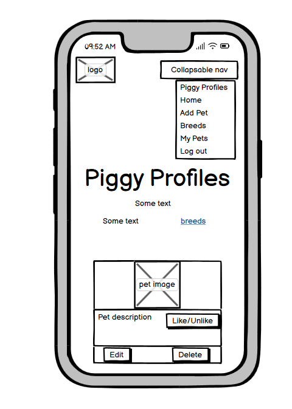

# [GUINEA PIG DATABASE](https://flask-guinea-pig-database-ccd8a0a6a383.herokuapp.com)

[](https://github.com/marina9222/guinea-pig-database/commits/main)
[](https://github.com/marina9222/guinea-pig-database/commits/main)
[](https://github.com/marina9222/guinea-pig-database)


# Description 

Piggy Profiles & Pics Hub is a website for guinea pig owners or just a guinea pig lover to register and add their own pet.
Once added people can like the pet and if it gets the most likes it will come first in the row on the home page.
Even if the user don't have a guinea pig can still register and check out the other guinea pigs and read about different breeds.
It's basically a database where users can show their guinea pig with a photo and description.


source: [amiresponsive](https://ui.dev/amiresponsive?url=https://flask-guinea-pig-database-ccd8a0a6a383.herokuapp.com)

## UX

The homepage effectively displays profiles with images and key details (breed, age, character) in a grid layout. This helps users quickly look and identify guinea pigs that they like.
The layout adjusts well to different screen sizes, ensuring usability on both desktops and mobile devices.The primary navigation menu includes essential links (Home, Log In, Register) making it easy for users to find and access these features.Each guinea pig profile provides relevant information such as breed, age, character traits, and owner’s name.
The design is straightforward, allowing users to browse profiles without unnecessary steps.

### Colour Scheme

- `#c6b6a7` used for primary color.
- `#e7d3c3` used for secondary color.
- `#d7b3a1` used for tertiery color.
- `#342719` used for primary text color.
- `#00796b` used for button color.

I used [coolors.co](https://coolors.co/c6b6a7-e7d3c3-d7b3a1-342719-00796b) to generate my colour palette.


I've used CSS `:root` variables to easily update the global colour scheme by changing only one value, instead of everywhere in the CSS file.

```css
:root {
    
    --main-color: #c6b6a7;
    --secondary-color: #e7d3c3;
    --tertiery-color: #d7b3a1;
    --text-color-primary: #342719;
    --secondary-text-color: #000000;
    --button-color: #00796b;
    --button-hover: #0d6357;
}
```

### Typography

- [Roboto](https://fonts.google.com/specimen/Roboto) was used for the primary headers and titles.

- [Montserrat](https://fonts.google.com/specimen/Montserrat) was used for all the other secondary text.

- [Font Awesome](https://fontawesome.com) icons were used throughout the site, such as the ones in the Register/Login form and Add and Edit pet form.


## User Stories

### New Site Users

- As a new site user, I would like to easily create an account, so that I can log in and browse the guinea pigs profiles.
- As a new site user, I would like to be able to browse the guinea pig profiles, even without a registration.
- As a new site user, I would like to add my pet, so that people can see it and like it.
- As a new site user, I would like to have a like/unlike buttons, so that I can choose which guinea pigs I like and which guinea pigs I don't.
- As a new site user, I would like to be able to edit my pet, if I make a mistake when adding it the first time or I would like to change its picture.
- As a new site user, I would like to be able to delete my pet, if I decide to.
- As a new site user, I would like to have a page with all the guinea pig breeds with some information about each breed and see only the pets from each breed I choose to check.

### Returning Site Users

- As a returning site user, I would like to have a liked pets section, so that I can see only the pets I liked already.
- As a returning site user, I would like to have a search bar available on the home page, so that I can search a guinea pig by name/age/breed etc.
- As a returning site user, I would like to receive notifications if I enable them, so that I can know every time a person adds a new pet.
- As a returning site user, I would like to have the option to add multiple pictures of my guinea pig when adding one instead of only one.
- As a returning site user, I would like to have a carousel with all the pets, so that I can navigate with arrows and don't have to go all the way down the page to see all of them.

## Wireframes

To follow best practice, wireframes were developed for mobile, tablet, and desktop sizes.
I've used [Balsamiq](https://balsamiq.com/wireframes) to design my site wireframes.

### Mobile Wireframes

<details>
<summary> Click here to see the Mobile Wireframes </summary>

Home
  - 

Home/Logged In
  - 

Add Pet
  - 

Edit Pet
  - 

Breeds
  - 

Breed Details
  - 

My Pets
  - 

Register
  - 

Log In
  - 


</details>

### Tablet Wireframes

<details>
<summary> Click here to see the Tablet Wireframes </summary>

Home
  - 

Home/Logged In
  - 

Add Pet
  - 

Edit Pet
  - 

Breeds
  - 

Breed Details
  - 

My Pets
  - 

Register
  - 

Log In
  - 


</details>


### Desktop Wireframes

<details>
<summary> Click here to see the Desktop Wireframes </summary>

Home
  - 

Home/Logged In
  - 

Add Pet
  - 

Edit Pet
  - 

Breeds
  - 

Breed Details
  - 

My Pets
  - 

Register
  - 

Log In
  - 


</details>


