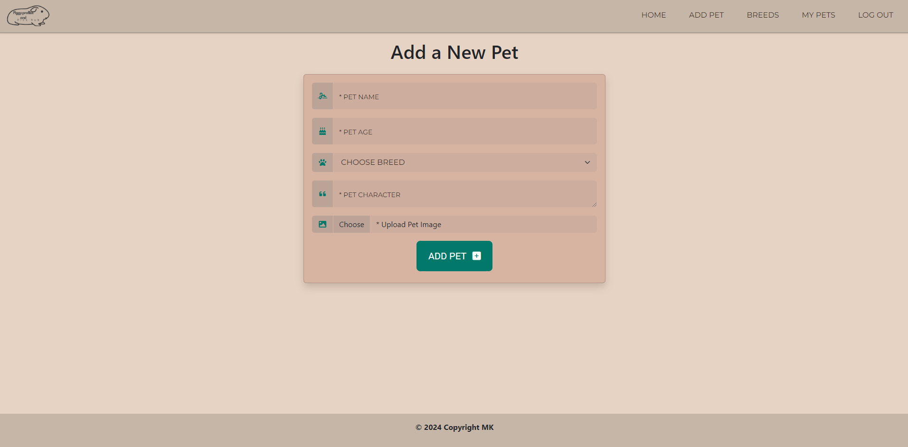

# Testing

> Return back to the [README.md](README.md) file.

## Code Validation

### HTML

I have used the recommended [HTML W3C Validator](https://validator.w3.org) to validate all of my HTML files.

| Directory | File | Screenshot | Notes |
| --- | --- | --- | --- |
| templates | add_pet.html |  | pass |
| templates | breed_details.html |  | pass |
| templates | breeds.html |  | pass |
| templates | edit_pet.html |  | pass |
| templates | login.html |  | pass |
| templates | my_pets.html |  | pass |
| templates | pets.html |  | pass |
| templates | register.html |  | pass |

### CSS

I have used the recommended [CSS Jigsaw Validator](https://jigsaw.w3.org/css-validator) to validate all of my CSS files.

| Directory | File | Screenshot | Notes |
| --- | --- | --- | --- |
| static | styles.css |  |pass |

### Python

I have used the recommended [PEP8 CI Python Linter](https://pep8ci.herokuapp.com) to validate all of my Python files.

| Directory | File | CI URL | Screenshot | Notes |
| --- | --- | --- | --- | --- |
|  | app.py | [PEP8 CI](https://pep8ci.herokuapp.com/https://raw.githubusercontent.com/marina9222/guinea-pig-database/main/app.py) |  | pass |

## Browser Compatibility

I've tested my deployed project on multiple browsers to check for compatibility issues.

| Browser | Home | Login | Register | Home/Logged in | Add Pet | Breeds | My Pets | Edit Pet | Breed Details | Notes |
| --- | --- | --- | --- | --- | --- | --- | --- | --- | --- | --- |
| Chrome |  |  |  |  |  |  |  |  |  | Works as expected |
| Firefox |  |  |  |  |  |  |  |  |  | Works as expected |
| Opera |  |  |  |  |  |  |  |  |  | Works as expected |

## Responsiveness

I've tested my deployed project on multiple devices to check for responsiveness issues.

| Device | Home | Login | Register | Home/Logged in | Add Pet | Breeds | My Pets | Edit Pet | Breed Details | Notes |
| --- | --- | --- | --- | --- | --- | --- | --- | --- | --- | --- |
| Mobile (DevTools) |  |  |  |  |  |  |  |  |  | Works as expected |
| Tablet (DevTools) |  |  |  |  |  |  |  |  |  | Works as expected |
| Desktop |  |  |  |  |  |  |  |  |  | Works as expected |
| Iphone 13 |  |  |  |  |  |  |  |  |  | Works as expected |

## Lighthouse Audit

I've tested my deployed project using the Lighthouse Audit tool to check for any major issues.

| Page | Mobile | Desktop | Notes |
| --- | --- | --- | --- |
| Home |  |  | Some minor warnings |
| Log In |  |  | Some minor warnings |
| Register |  |  | Some minor warnings |
| Home/Logged In |  |  | Slow load due to large images |
| Add Pet |  |  | Some minor warnings |
| Breeds |  |  | Some minor warnings |
| My Pets |  |  | Slow load due to large images |
| Edit Pet |  |  | Some minor warnings |
| Breed Details |  |  | Some minor warnings |

