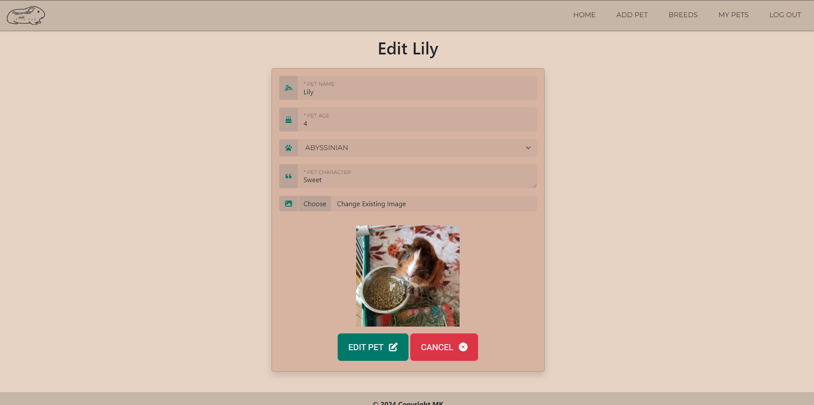
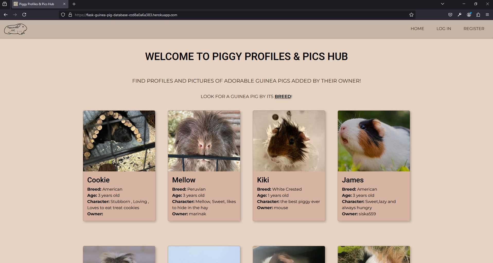
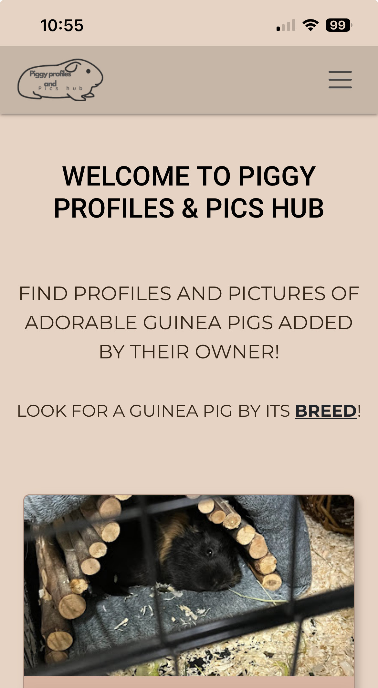
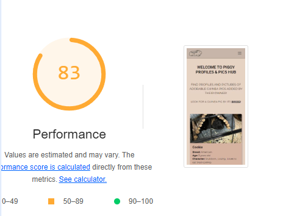
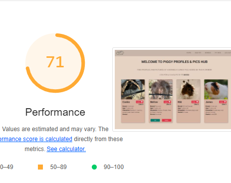
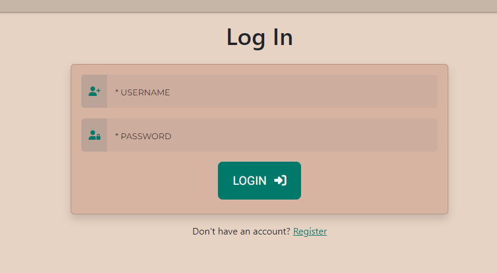

# Testing

> Return back to the [README.md](README.md) file.

## Code Validation

### HTML

I have used the recommended [HTML W3C Validator](https://validator.w3.org) to validate all of my HTML files.

| Directory | File | Screenshot | Notes |
| --- | --- | --- | --- |
| templates | add_pet.html |  | pass |
| templates | breed_details.html |  | pass |
| templates | breeds.html |  | pass |
| templates | edit_pet.html |  | pass |
| templates | login.html |  | pass |
| templates | my_pets.html |  | pass |
| templates | pets.html |  | pass |
| templates | register.html |  | pass |

### CSS

I have used the recommended [CSS Jigsaw Validator](https://jigsaw.w3.org/css-validator) to validate all of my CSS files.

| Directory | File | Screenshot | Notes |
| --- | --- | --- | --- |
| static | styles.css |  |pass |

### Python

I have used the recommended [PEP8 CI Python Linter](https://pep8ci.herokuapp.com) to validate all of my Python files.

| Directory | File | CI URL | Screenshot | Notes |
| --- | --- | --- | --- | --- |
|  | app.py | [PEP8 CI](https://pep8ci.herokuapp.com/https://raw.githubusercontent.com/marina9222/guinea-pig-database/main/app.py) |  | pass |

## Browser Compatibility

I've tested my deployed project on multiple browsers to check for compatibility issues.

| Browser | Home | Login | Register | Home/Logged in | Add Pet | Breeds | My Pets | Edit Pet | Breed Details | Notes |
| --- | --- | --- | --- | --- | --- | --- | --- | --- | --- | --- |
| Chrome |  |  |  |  |  |  |  |  |  | Works as expected |
| Firefox |  |  |  |  |  |  |  |  |  | Works as expected |
| Opera |  |  |  |  |  |  |  |  |  | Works as expected |

## Responsiveness

I've tested my deployed project on multiple devices to check for responsiveness issues.

| Device | Home | Login | Register | Home/Logged in | Add Pet | Breeds | My Pets | Edit Pet | Breed Details | Notes |
| --- | --- | --- | --- | --- | --- | --- | --- | --- | --- | --- |
| Mobile (DevTools) |  |  |  |  |  |  |  |  |  | Works as expected |
| Tablet (DevTools) |  |  |  |  |  |  |  |  |  | Works as expected |
| Desktop |  |  |  |  |  |  |  |  |  | Works as expected |
| Iphone 13 |  |  |  |  |  |  |  |  |  | Works as expected |

## Lighthouse Audit

I've tested my deployed project using the Lighthouse Audit tool to check for any major issues.

| Page | Mobile | Desktop | Notes |
| --- | --- | --- | --- |
| Home |  |  | Some minor warnings |
| Log In |  |  | Some minor warnings |
| Register |  |  | Some minor warnings |
| Home/Logged In |  |  | Slow load due to large images |
| Add Pet |  |  | Some minor warnings |
| Breeds |  |  | Some minor warnings |
| My Pets |  |  | Slow load due to large images |
| Edit Pet |  |  | Some minor warnings |
| Breed Details |  |  | Some minor warnings |

## Defensive Programming

| Page | Expectation | Test | Result | Fix | Screenshot |
| --- | --- | --- | --- | --- | --- |
| Register | | | | | |
| | Feature is expected to open a register form for the user to regiter an account | Tested the feature by doing it | The feature behaved as expected, and it did registered without problems| Test concluded and passed |  |
| Log In | | | | | |
| | Feature is expected to sign in the user when the form is filled and the user name and password match | Tested the feature by log in my account | The feature behaved as expected, and it did logged me in | Test concluded and passed |  |
| Add Pet | | | | | |
| | Feature is expected to add a new pet owned by the user when the form is filled | Tested the feature by adding a pet | The feature behaved as expected, and it did added the pet | Test concluded and passed |  |
| Breeds | | | | | |
| | Feature is expected to do help the user find guinea pigs by breed | Tested the feature by clicking on every breed to check for the pets if they match | The feature behaved as expected, and it did show all the pets by breeds | Test concluded and passed |  |
| Breed Details | | | | | |
| | Feature is expected to view the pets from this breed and read some information about the chosen breed | Tested the feature by doing it | The feature behaved as expected, and it did show the pets and the information of every breed | Test concluded and passed |  |
| My Pets | | | | | |
| | Feature is expected to show the user only their own pets and if they dont have any to show a message saying: You have not added any pets yet. | Tested the feature by doing it | Feature is expected and shows only my pets | Test concluded and passed |  |
| Edit Pet | | | | | |
| | Feature is expected to allow the user to edit their pet by clicking the edit button. | Tested the feature by trying to edit one of my pets. | The feature behaved as expected, and it opened a form to edit my pet. | Test concluded and passed |  |
| Home/My Pets | | | | | |
| | Feature is expected to allow the user to delete their own pets if needed. | Tested the feature by trying to delete one of my pets. | The feature behaved as expected, and it deleted my pet. | Test concluded and passed  |  |
| Home | | | | | |
| | Feature is expected to allow a registered user to unlike a pet if clicked liked by mistake. | Tested the feature by clicking on unlike button. |  The feature behaved as expected, and it unliked a pet. | Test concluded and passed |  |
| Home | | | | | |
| | Feature is expected to allow a registered user to like a pet. | Tested the feature by clicking on like button. | The feature behaved as expected, and it liked the chosen pet. | Test concluded and passed |  |

## User Story Testing

| User Story | Screenshot |
| --- | --- |
| As a new site user, I would like to easily create an account, so that I can log in and browse the guinea pigs profiles. |  |
| As a new site user, I would like to be able to browse the guinea pig profiles, even without a registration.|  |
| As a new site user, I would like to add my pet, so that people can see it and like it. |  |
| As a new site user, I would like to have a like/unlike buttons, so that I can choose which guinea pigs I like and which guinea pigs I don't. |  |
| As a new site user, I would like to be able to edit my pet, if I make a mistake when adding it the first time or I would like to change its picture. |  |
| As a new site user, I would like to be able to delete my pet, if I decide to. |  |
| As a new site user, I would like to have a page with all the guinea pig breeds with some information about each breed and see only the pets from each breed I choose to check. |  |
| As a returning site user, I would like to have a liked pets section, so that I can see only the pets I liked already. | future features |
| As a returning site user, I would like to have a search bar available on the home page, so that I can search a guinea pig by name/age/breed etc. | future features | 
| As a returning site user, I would like to receive notifications if I enable them, so that I can know every time a person adds a new pet. | future features | 
| As a returning site user, I would like to have the option to add multiple pictures of my guinea pig when adding one instead of only one. | future features | 
| As a returning site user, I would like to have a carousel with all the pets, so that I can navigate with arrows and don't have to go all the way down the page to see all of them. | future features | 

## Bugs

- Python : values for both 'fields' and 'body' error when try to upload picture using Cloudinary

    - To fix this, I updated cloudinary with the latest version.

- Python TypeError: 'Collection' object is not callable.

    

    - To fix this, I changed the code line `mongo.db.pets.update_one({"_id":ObjectId(pet_id)},submit) to mongo.db.pets.update_one({"_id":ObjectId(pet_id)},{"$set":update_data})`.

- Python jinja : UndefinedError

    

    - To fix this, I added another pet object so it can access the nested object structure.

- Materialize : Cards bug

    

    - To fix this, I have to transform my whole project from Materialize to Bootstrap as Materialize has a bug in the framework so you actually can't have a responsive layout.

    

    

## Unfixed Bugs
 
> There are no remaining bugs that I am aware of.
